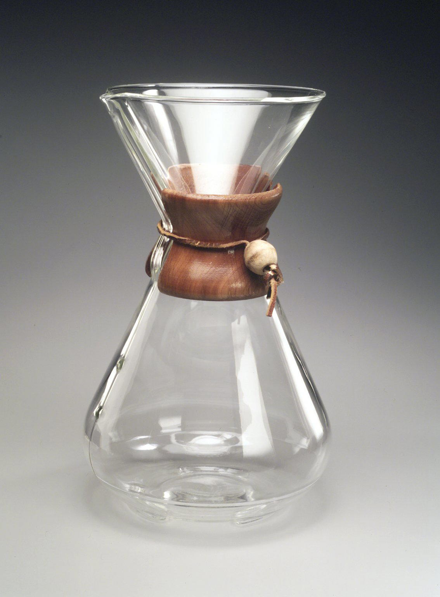

# 02 · Design Object

## Form language

- **Vessel:** one-piece **borosilicate** hourglass — upper conical funnel (~60°) over an Erlenmeyer-like lower flask
- **Air / pour feature:** internal groove / lip that doubles as pour spout and air vent (see patent Figs 1–2)
- **Collar:** wood band at the waist — grip + thermal insulation + brand punctuation
- **Tie:** leather (or similar) fastening
- **Filter:** proprietary thick **bonded** paper cone that follows the upper funnel

*Brooklyn Museum object photo — open license. Credit & rights: [SOURCES](../assets/SOURCES.md).*

## Why designers care

The Chemex is often read as Bauhaus-adjacent **form follows function**: transparent process, honest materials, laboratory typology adapted for the home. MoMA collected it early — accession **[51.1943](https://www.moma.org/collection/works/1847)** — and put it on the cover of the *[Useful Objects in Wartime](https://assets.moma.org/documents/moma_catalogue_2733_300164646.pdf)* bulletin.

Curatorial essays worth assigning:

- Cooper Hewitt — [The Perfect Cup](https://www.cooperhewitt.org/2018/04/06/the-perfect-cup-coffee-brewed-to-perfection/) (object also in [Cooper Hewitt collection](https://collection.cooperhewitt.org/objects/18643921/))
- MODERN Magazine — [Curator’s Eye: Chemex](http://modernmag.com/curators-eye-chemex-coffeemaker-by-peter-schlumbohm/)
- Collectors Weekly — [Mr. Chemex](https://www.collectorsweekly.com/articles/mr-chemex/)

## Looking exercise

Ask participants to describe the object **without** saying “coffee.” What metaphors appear (lab flask? lamp? sculpture?)?

## Materials & making

| Part | Material (typical) | Role |
|------|--------------------|------|
| Body | Borosilicate glass | Thermal resilience, visibility of brew |
| Collar | Wood | Grip, insulation, mid-century identity |
| Tie | Leather / cord | Secures collar |
| Filter | Bonded paper (thicker than many drip papers) | Retains oils & fines → clearer cup, lighter body |

Wartime production later secured Corning / Pyrex glass under material constraints — useful context for Module 01.

> **REVIEW:** Confirm current Chemex Corp. production materials (collar wood species, tie, glass source) vs. historic variants before handouts. Brand: [About Us](https://chemexcoffeemaker.com/pages/about-us).

> **REVIEW:** MoMA / LIFE photography for slides needs **rights clearance** — do not hotlink museum assets into public Pages without permission. Brooklyn Commons image is OK for draft teaching (CC).

## Assets

- Product photo (open): `assets/images/BrooklynMuseum_Chemex_1997.117_CC-BY.jpg`
- Lifestyle photo (CC0): `assets/images/Chemex_Unsplash_ZacharyNewton_CC0.jpg`
- Detail shots (collar, spout, filter fold) — `TODO`
