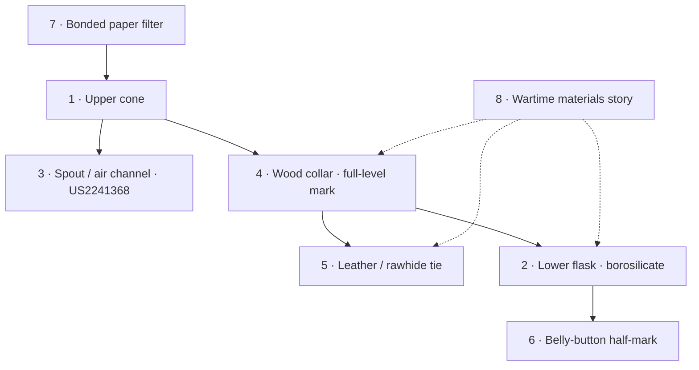

# Design attributes

Workshop-facing anatomy of the Chemex as a design object — consolidating MoMA / Cooper Hewitt reading with patent teaching points ([US 2,241,368](https://patents.google.com/patent/US2241368A/en)).


*Annotated product anatomy (brand reference still). Rights: keep under **REVIEW** before public projection — see [NOTES](/NOTES.md) and [ART-DIRECTION](/art-of-chemex/assets/reference/ART-DIRECTION.md).*

## Attribute diagram

```
           ┌─ bonded thick paper filter (7)
           │
      ╔════╧════╗
      ║  upper  ║  ← hourglass / dual-cone (1)
      ║  cone   ║     lab Erlenmeyer lineage
      ║         ║
   ┌──╫─ spout ╫──┐  ← pour spout = air channel (3)  US2241368
   │  ║         ║  │
   └──╢ wood ╟──┘  ← wood collar (4) · handle + full-level mark
      ║collar ║       (bottom edge of collar)
      ║  +   ║
      ║ tie  ║       ← leather / rawhide tie (5)
      ║         ║
      ║  belly  ║  ← belly-button half-mark (6)
      ║  button ║
      ║         ║
      ║  lower  ║  ← borosilicate glass (2) · inert, thermal
      ║  flask  ║
      ╚═════════╝
```

## Eight attributes

| # | Attribute | Teaching point |
|---|-----------|----------------|
| **1** | **Hourglass / dual-cone geometry** | One-piece vessel: upper conical funnel (~60°) over an Erlenmeyer-like lower flask — laboratory typology adapted for the kitchen. |
| **2** | **Borosilicate glass** | Inert, thermally resilient; brew stays visible; Pyrex / Corning lineage under wartime production. |
| **3** | **Pour spout = air channel** | Internal groove / lip doubles as pour spout **and** air vent so liquid exits without vacuum lock — core claim of **[US2241368](https://patents.google.com/patent/US2241368A/en)** (Figs 1–2). |
| **4** | **Wood collar** | Handle + thermal insulation; **full-level mark** at the bottom edge of the collar (waist). |
| **5** | **Leather / rawhide tie** | Soft fastener securing the collar — craft contrast to lab glass. |
| **6** | **Belly-button half-mark** | Raised glass nub on the lower flask — half-capacity cue for brew volume. |
| **7** | **Bonded thick paper filter** | Proprietary multi-layer cone; retains more oils and fines than typical drip paper → high clarity, lighter body. |
| **8** | **Wartime / non-priority materials** | Glass, wood, and leather could stay in production when metals were redirected — MoMA *Useful Objects in Wartime* framing (1942–43). |

## Schematic (parts)



## Cross-links

- **Patent drawings:** [04 · Patent Drawings](04-patent-drawings.md) — US2241368 + USD137943
- **MoMA object:** accession **[51.1943](https://www.moma.org/collection/works/1847)** · *[Useful Objects in Wartime](https://www.moma.org/calendar/exhibitions/2733)* bulletin
- **Design object module:** [02 · Design Object](02-design-object.md)
- **How it works:** [03 · How It Works](03-how-it-works.md)
- **HQ product refs:** [09 · Art reference](09-art-reference.md)

> **REVIEW:** Brand annotated JPG (`chemex-anatomy-design-annotated.jpg`) — confirm rights / attribution before slides or public projection. Open-license Brooklyn Commons photo remains the safe default for handouts.
